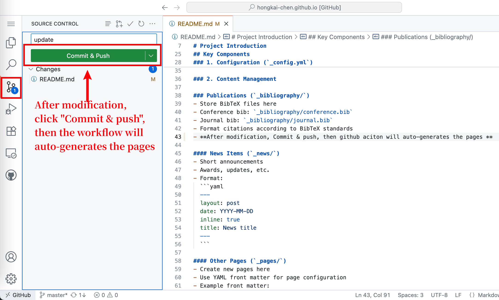

# Quick Start
```
1. [Github Code Spases] Open https://github.dev/hongkai-chen/hongkai-chen.github.io
2. Enjoy!
```

# Project Introduction
## Directory Structure

```
.
├── _bibliography    # BibTeX files for publications
├── _data           # Website configuration files
├── _includes       # Layout components
├── _layouts        # Page templates
├── _news          # News items
├── _pages         # Main website pages
├── _posts         # Blog posts
├── _projects      # Project descriptions
├── _sass          # Style files
├── assets         # Static files (images, documents, etc.)
└── _site          # Generated website (do not edit)
```

## Key Components


### 1. Configuration (`_config.yml`)
The main configuration file where you can set:
- Personal information
- Website appearance
- Social links
- Navigation menu
- Build settings

### 2. Content Management

### Publications (`_bibliography/`)
- Store BibTeX files here
- Conference bib: `_bibliography/conference.bib`
- Journal bib: `_bibliography/journal.bib`
For publications: 

- Format citations according to BibTeX standards
- After modification, **Commit & push**, then github aciton will auto-generates the pages


#### News Items (`_news/`)
- Short announcements
- Awards, updates, etc.
- Format:
  ```yaml
  ---
  layout: post
  date: YYYY-MM-DD
  inline: true
  title: News title
  ---
  ```
For news: 


#### Other Pages (`_pages/`)
- Create new pages here
- Use YAML front matter for page configuration
- Example front matter:
  ```yaml
  ---
  layout: page
  title: About
  permalink: /about/
  ---
  ```
#### Blog Posts (`_posts/`)
- Name format: `YYYY-MM-DD-title.md`
- Location: `_posts/` directory
- Include front matter:
  ```yaml
  ---
  layout: post
  title: Your Post Title
  date: YYYY-MM-DD
  description: Brief description
  tags: [tag1, tag2]
  ---
  ```
#### Projects (`_projects/`)
- Create project descriptions
- Include images and details
- Front matter example:
  ```yaml
  ---
  layout: page
  title: Project Name
  description: Project description
  img: /assets/img/project-thumbnail.jpg
  ---
  ```

### 3. Assets Management

#### Images (`assets/img/`)
- Store all images here
- Recommended formats: jpg, png, webp
- Optimize images for web
- Reference in markdown: ``

#### Documents (`assets/pdf/`)
- Store PDFs and other documents
- Reference: `[Document Name](/assets/pdf/your-document.pdf)`


### 4. Styling

#### CSS (`_sass/`)
- Customize website appearance
- Main files:
  - `_base.scss`: Basic styles
  - `_layout.scss`: Layout components
  - `_variables.scss`: Color schemes and variables

## Quick Start Guide

1.1 **Edit use github.dev**
   ```
   1. Open https://github.dev/hongkai-chen/hongkai-chen.github.io
   2. Enjoy!
   ```

1.2 **Local Development(ignore this part if using github.dev)**
   ```bash
   docker compose up -d
   ```
   or 
   ```bash
   bundle install
   bundle exec jekyll serve
   ```
   
2. **Updating Content**
   - Add news items in `_news/`
   - Add conference in `_bibliography/conference.bib`
   - Add journal in `_bibliography/journal.bib`
   - Create new pages in `_pages/`
   - Add blog posts in `_posts/`
   - Update projects in `_projects/`
   
3. **Customization**
   - Edit `_config.yml` for site settings
   - Modify `_sass/` files for styling
   - Update `_data/` files for navigation and other data

4. **Images and Files**
   - Upload images to `assets/img/`
   - Store documents in `assets/pdf/`
   - Use relative paths in markdown

## Best Practices

1. **Image Optimization**
   - Compress images before uploading
   - Use appropriate image formats
   - Maintain consistent dimensions

2. **Content Organization**
   - Keep file names descriptive
   - Use proper front matter
   - Maintain consistent formatting

3. **Version Control**
   - Commit changes regularly
   - Use meaningful commit messages
   - Back up your content

## Support and Resources

- [Al-folio Documentation](https://github.com/alshedivat/al-folio)
- [Jekyll Documentation](https://jekyllrb.com/docs/)
- [GitHub Pages Help](https://docs.github.com/en/pages)
